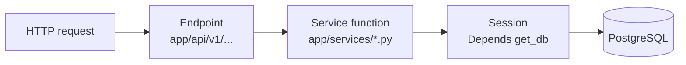

# Database CRUD tutorial

How to read and write data through this API's PostgreSQL database.

This project uses **SQLAlchemy 2.0 (ORM)**. Every request gets its own database
`Session` (injected via the `Depends(get_db)` dependency in
`app/db/session.py`) and talks to the DB through **service functions** in
`app/services/` — endpoints stay thin.



The examples below use the `Heartbeat` model (`app/models/heartbeat.py`) as
the table. It was chosen because it is the first model in the project; the
same patterns apply to every future model.

---

## 0. The three pieces you touch

| Concern | Where | Example |
|---|---|---|
| Schema of the table | `app/models/` | `Heartbeat` class |
| Business logic / queries | `app/services/` | `heartbeats.py` |
| Request/response shapes | `app/schemas/` | `HeartbeatCreate` |

`SessionLocal` / `engine` live in `app/db/session.py`. They are already
configured — you never create an engine yourself.

---

## 1. Sessions and transactions (read this first)

A `Session` is a **unit of work**: it tracks the objects you load or create
and wraps them in one transaction.

- Nothing hits the DB until you `commit()` (or `flush()`).
- `commit()` ends the transaction and writes your changes.
- `rollback()` discards the uncommitted changes.
- `close()` returns the connection to the pool — this always happens for you,
  because `get_db()` yields a session and closes it in a `finally` block.

The scaffold's `sessionmaker` uses `autocommit=False`, `autoflush=False`, and
`expire_on_commit=False`. Concretely:

- `autoflush=False` — queries don't secretly flush pending changes first.
- `expire_on_commit=False` — your loaded objects keep their attribute values
  after `commit()` (you don't get "detached instance" surprises).
- `autocommit=False` — you must call `commit()` explicitly.

Rule of thumb: **services that write call `db.commit()`; pure reads don't.**

---

## 2. C — Create

Add an object, commit, then `refresh()` to pull server-side values (like
`received_at`, which Postgres fills in with `now()`).

```python
# app/services/heartbeats.py (style reference)

def create_heartbeat(db: Session, payload: dict) -> Heartbeat:
    """Insert one heartbeat and return the persisted row."""
    row = Heartbeat(**payload)          # kwargs must match model columns
    db.add(row)                         # stage the insert
    db.commit()                         # send it to Postgres
    db.refresh(row)                     # reload server defaults (received_at)
    return row
```

If you already have the row's primary key and want "insert or ignore"
(idempotent retries from a sync worker), use the bulk upsert in
`ingest_heartbeats()` — it compiles to `INSERT ... ON CONFLICT DO NOTHING`.

---

## 3. R — Read

Reads are `select()` statements executed against the session. No commit.

```python
from sqlalchemy import select
from sqlalchemy.orm import Session

from app.models.heartbeat import Heartbeat


def get_heartbeat(db: Session, heartbeat_id: str) -> Heartbeat | None:
    """Read one row by primary key."""
    return db.get(Heartbeat, heartbeat_id)


def list_heartbeats(
    db: Session,
    application: str | None = None,
    limit: int = 50,
    offset: int = 0,
) -> list[Heartbeat]:
    """Read a filtered, paged slice of heartbeats, newest first."""
    stmt = select(Heartbeat).order_by(Heartbeat.received_at.desc())
    if application:
        stmt = stmt.where(Heartbeat.application == application)
    return db.scalars(stmt.offset(offset).limit(limit)).all()
```

Query building blocks you'll use constantly:

| You want | Code |
|---|---|
| One row by PK | `db.get(Heartbeat, "abc-123")` |
| Filter | `.where(Heartbeat.application == "code.exe")` |
| Order | `.order_by(Heartbeat.received_at.desc())` |
| Limit / skip | `.limit(50).offset(0)` |
| First match (or None) | `db.scalar(stmt)` / `db.execute(stmt).scalars().first()` |
| Count | `db.scalar(select(func.count()).select_from(Heartbeat))` |
| Only certain columns | `select(Heartbeat.id, Heartbeat.application)` |
| OR / IN / NOT | `.where(or_(...))`, `.where(Heartbeat.event_type.in_([...]))`, `.where(~Heartbeat.is_ok)` |

`db.scalars(stmt).all()` returns a list of model instances — the common case.
Use `.unique()` if you ever join to a to-many relationship.

---

## 4. U — Update

Two styles: **load → mutate → commit** (fine for a single row) or a
**bulk `update()`** (many rows, or when you don't need the object back).

```python
def update_application(
    db: Session, heartbeat_id: str, new_application: str
) -> Heartbeat | None:
    """Change one field on one row; returns the refreshed row."""
    row = db.get(Heartbeat, heartbeat_id)
    if row is None:
        return None
    row.application = new_application   # mutate the tracked object
    db.commit()
    db.refresh(row)
    return row
```

Bulk update (no ORM objects loaded, one SQL statement):

```python
from sqlalchemy import update

db.execute(
    update(Heartbeat)
    .where(Heartbeat.application == "old-name.exe")
    .values(window_title=None)
)
db.commit()
```

---

## 5. D — Delete

```python
def delete_heartbeat(db: Session, heartbeat_id: str) -> bool:
    """Delete one row; returns True if it existed."""
    row = db.get(Heartbeat, heartbeat_id)
    if row is None:
        return False
    db.delete(row)
    db.commit()
    return True
```

---

## 6. Exposing CRUD over HTTP

Services above don't know HTTP exists. A router wires them to the world,
validating bodies with Pydantic schemas. Reference shape for a future
`app/api/v1/endpoints/heartbeats.py`:

```python
from fastapi import APIRouter, Depends, HTTPException
from sqlalchemy.orm import Session

from app.db.session import get_db
from app.schemas.heartbeat import HeartbeatCreate
from app.services import heartbeats as service

router = APIRouter(tags=["heartbeats"])


@router.get("")
def list_items(
    application: str | None = None,
    limit: int = 50,
    offset: int = 0,
    db: Session = Depends(get_db),
):
    return service.list_heartbeats(db, application=application,
                                    limit=limit, offset=offset)


@router.get("/{heartbeat_id}")
def get_item(heartbeat_id: str, db: Session = Depends(get_db)):
    row = service.get_heartbeat(db, heartbeat_id)
    if row is None:
        raise HTTPException(status_code=404, detail="Heartbeat not found")
    return row


@router.post("", status_code=201)
def create_item(payload: HeartbeatCreate, db: Session = Depends(get_db)):
    return service.create_heartbeat(db, payload.model_dump())


@router.patch("/{heartbeat_id}")
def update_item(
    heartbeat_id: str,
    body: dict,  # use a Pydantic model, e.g. HeartbeatUpdate
    db: Session = Depends(get_db),
):
    row = service.update_application(db, heartbeat_id, body["application"])
    if row is None:
        raise HTTPException(status_code=404, detail="Heartbeat not found")
    return row


@router.delete("/{heartbeat_id}", status_code=204)
def delete_item(heartbeat_id: str, db: Session = Depends(get_db)):
    if not service.delete_heartbeat(db, heartbeat_id):
        raise HTTPException(status_code=404, detail="Heartbeat not found")
```

Register it in `app/api/v1/router.py`:

```python
from app.api.v1.endpoints import heartbeats

api_router.include_router(
    heartbeats.router, prefix="/heartbeats", tags=["heartbeats"]
)
```

Status-code notes: `201` after a create, `204` (no body) after a delete, and
`404` for a missing row.

---

## 7. Trying it yourself

Prereqs: Postgres is up, `DATABASE_URL` is correct in `.env`, and you ran
`alembic upgrade head` so the `heartbeats` table exists.

**Option A — standalone script** (no server, direct session). Save as
`docs/examples/crud_demo.py` and run `python docs/examples/crud_demo.py` from
the `api/` directory:

```python
import uuid

from app.db.session import SessionLocal
from app.models.heartbeat import Heartbeat


def main() -> None:
    db = SessionLocal()
    try:
        # CREATE
        row = Heartbeat(
            id=str(uuid.uuid4()),
            state_id=str(uuid.uuid4()),
            source="os",
            application="code.exe",
            event_type="HEARTBEAT",
            timestamp="2026-09-07T12:00:00",
            duration_seconds=60.0,
            process_id=1234,
            window_title="main.py",
        )
        db.add(row)
        db.commit()
        print("created:", row.id)

        # READ
        loaded = db.get(Heartbeat, row.id)
        print("read:", loaded)

        # UPDATE
        loaded.duration_seconds = 120.0
        db.commit()
        db.refresh(loaded)
        print("updated duration:", loaded.duration_seconds)

        # DELETE
        db.delete(loaded)
        db.commit()
        print("deleted")
    finally:
        db.close()


if __name__ == "__main__":
    main()
```

**Option B — through the API.** Once the heartbeats router is registered
(section 6) and the server is running:

```bash
# Create
curl -X POST http://127.0.0.1:8000/api/v1/heartbeats \
  -H "Content-Type: application/json" \
  -d '{"id":"a1b2c3d4","state_id":"s1","application":"code.exe","event_type":"HEARTBEAT","timestamp":"2026-09-07T12:00:00","duration_seconds":60.0}'

# Read a list
curl "http://127.0.0.1:8000/api/v1/heartbeats?application=code.exe&limit=10"

# Read one
curl http://127.0.0.1:8000/api/v1/heartbeats/a1b2c3d4

# Update (PATCH with a JSON body)
curl -X PATCH http://127.0.0.1:8000/api/v1/heartbeats/a1b2c3d4 \
  -H "Content-Type: application/json" -d '{"application":"notepad.exe"}'

# Delete
curl -X DELETE -i http://127.0.0.1:8000/api/v1/heartbeats/a1b2c3d4
```

---

## Common mistakes

- **Forgetting `commit()`** — the row never reaches the DB and your object
  silently "loses" changes at the end of the request.
- **Committing in read-only paths** — unnecessary; reads need no commit.
- **Building the engine yourself** — always use `get_db()` / `SessionLocal`
  from `app/db/session.py` so pool/session settings stay consistent.
- **Editing a model, not a schema** — HTTP bodies are validated by Pydantic
  schemas in `app/schemas/`; DB columns live in `app/models/`. Change the
  model *and* migrate (`alembic revision --autogenerate`, `alembic upgrade
  head`), and change the schema to expose/accept the new field.
- **Blocking calls in `async def` endpoints** — keep DB work in `def`
  endpoints (FastAPI runs them in a threadpool) or use `async_session`.
